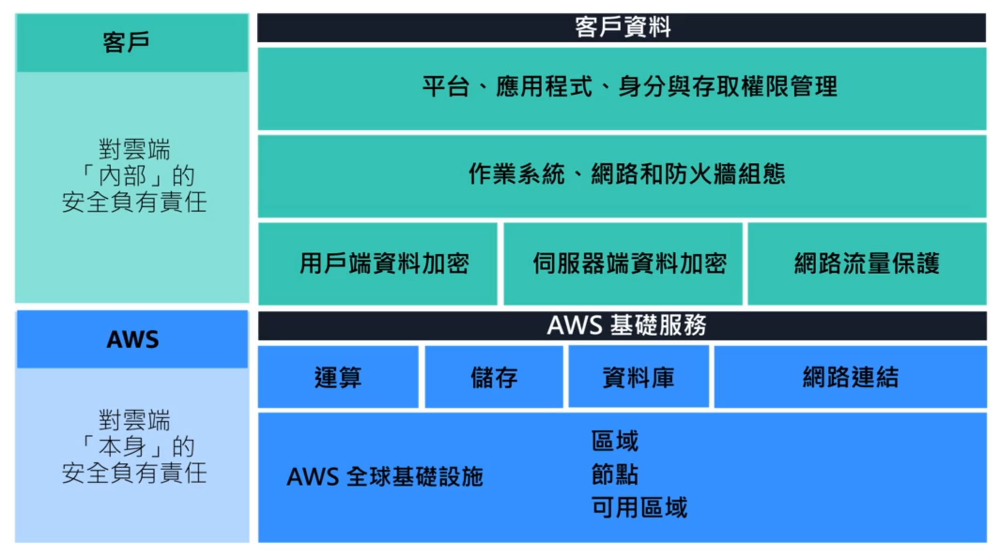

## 共同責任模型

+ AWS 負責雲端==本身==的安全
+ 客戶負責雲端==內部==的安全

## 使用者許可與存取權限

+ AWS Root User
	+ 帳戶擁有者
	+ 可以在帳戶內做任何想做的事情

+ 最低權限原則
	+ 僅授予使用者他須使用的最低權限
### AWS Identity and Access Management(AWS IAM)

+ Root user
+ IAM user
	+ 預設沒有任何權限
+ policy
	+ JSON文件
	+ Statement
		+ Effect(allow or deny)
		+ Action
		+ Resource
+ group
	+ 透過將policy連接到group，可以讓group內的成員都使用該policy的權限
+ role
	+ 適合==暫時授予==的情況
	+ 具由暫時性的特性
	+ 具備關聯許可，可允許或拒絕特定的動作
	+ 無使用者名稱和密碼
	+ 當擔任role時，會==捨棄過去所有的許可==，改取得該角色的許可
+ 可透過聯合其他使用者的方式，將他們對應到適當的IAM role，而不必為所有人建立IAM user

## AWS Organizations

+ 管理多個AWS帳戶的中央位置
	+ 預設4個帳戶
	+ 集中式管理
	+ 合併所有帳戶帳單
	+ 實施帳戶分層(Organization Unit)
	+ 調整AWS服務和API動作
		+ 透過SCP(Service Control Policy)

## Compilance

+ AWS Artifact
	+ 用於==隨時存取==AWS安全性與合規報告和選取線上協議
	+ Artifact協議
		+ 與AWS簽訂使用特定類型資訊的協定
	+ Artifact報告
		+ 提供來自thrid-party稽核人員的合規報告
+ AWS Compilance
	+ 包含各種合規資源
	+ 了解各種受管公司如何解決合規、管控、稽核問題

## DDOS

+ UDP flood
	+ 可透過Security Group預防
+ HTTP level attack
+ SlowLoris
	+ 利用ELB解決

## AWS Shield Standard

+ 免費自動保護所有AWS客戶
## AWS Shield Advanced

+ 付費服務
+ 提供詳細的攻擊診斷、偵測、減輕複雜的DDOS攻擊
+ 可與CloudFront、Route 53、ELB等結合

## 其他安全服務

AWS加密方式
+ 靜態
	+ 替閒置儲存的資料加密
+ 動態
	+ 傳輸中加密
### AWS WAF

+ Web應用程式防火牆
+ 監控進入Web應用程式的網路要求
### AWS Key Management System(AWS KMS)

+ 管理加密金鑰的系統
+ 可選擇金鑰的特定存取控制層級
+ 替EBS進行加密/解密操作

### AWS Inspector(安全分析)

+ 由三個部分組成
	+ 網路組態可達性
	+ 可安裝EC2執行個體的Amazon代理程式
	+ 安全性評估服務
+ 自動化的安全評估
+ 包含修正建議
### AWS GuardDuty(威脅偵測)

+ 威脅偵測服務
+ 分析中繼資料的連續串流
+ 分析來自AWS資源的資料
+ 與其他服務分開執行
+ 包含修復建議
	