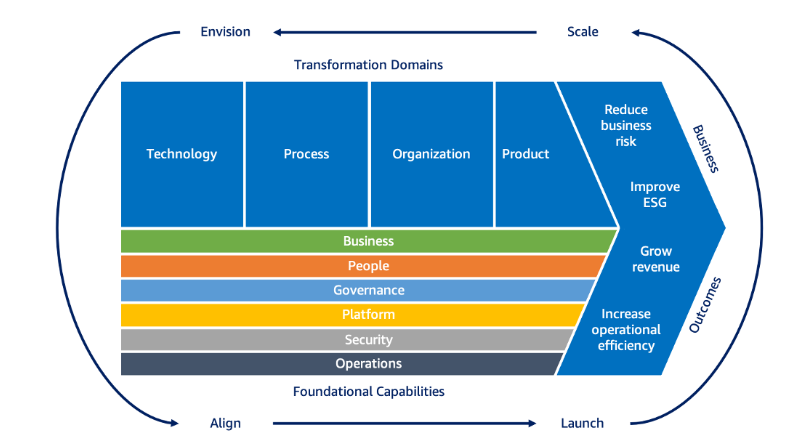

+ AWS CAF六大元素
+ AWS Cloud Transformation Journey

+ Envision
	+ 評估、確認商業成果
+ Align
	+ 制定詳細計畫訓練人員
+ Scale
	+ 擴大雲端規模
+ Launch
	+ 啟用雲端作業
---
+ AWS Support 
+ AWS Well-Architected Framework
	+ 卓越營運 vs 可靠性
	+ 可靠性 
		+ 工作負載一致且正確執行預期功能的能力
	+ 卓越營運
		+ 有效執行工作負載，並深入了解其作業
## Innovation

+ Amazon Polly
	+ 文字轉聲音
+ Amazon Rekognition
	+ 影像辨識平台
+ AWS QuickSight Q
	+ 利用自然語言回答BI相關問題
+ AWS Kendra
	+ 智能企業搜索服務
	+ 利用機器學習和NLB方式找尋==有價值訊息==
+ AWS Personalize
	+ 機器學習服務
	+ 幫助開發者構建個性化推薦系統
## Security

+ SSH pub key
	+ 用來安全連接到EC2 Instance

+ Access key
	+ ==透過CLI或API呼叫資源時需要使用==

+ AWS Identity Center
	+ 集中式身分管理服務

+ AWS Cognito
	+ 提供mobile及web application應用身分驗證的服務
+ AWS WorkLink
	+ 移動端託管服務，用於提供對內部Web程式進行安全訪問

+ AWS Private Link
	+ 在安全的在VPC訪問AWS服務及第三方服務
	+ 無須流量離開==AWS網路==

+ Amazon Security Hub
	+ 彙總提醒
	+ 執行安全檢查
	+ 可啟用自動修復

+ Amazon Macie
	+ 資料安全與資料隱私服務
	+ 利用機器學習技術找出敏感資訊，並提供隱私防護

+ Amazon Detective
	+ 安全調查服務
	+ 透過分析AWS資源和日誌，找尋潛在問題

+ AWS IAM Center

+ IAM SSH key
	+ 用於安全連線到EC2 instance 

+ AWS System Manager
	+ 綜合管理服務
	+ ==目的在於自動化與簡化系統管理==

+ AWS Systems Manager Session Manager
	+ 託管服務
	+ 提供對EC2 instance的Secure Shell訪問

+ AWS Security Token Service
	+ 臨時發放安全憑證
		+ 僅短期有效
## Network

+ AWS Transit Gateway
	+ ==可以簡化雲端網絡拓撲並大規模擴展網絡連接==
## Misc
+ AWS Config
	+ 用於紀錄和評估config

+ AWS Managed Services(AMS)
	+ 專門為希望通過AWS專業團隊獲得全面運營支持的客戶而設計

+ AWS Service Catalog
	+ ==Create, share, organize, and govern your curated IaC templates==

+ AWS CodeStar
	+ 簡化構建、部屬、管理應用程式的流程
	+ CI/CD

+ AWS DataSync
	+ 線上數據傳輸

+ AWS Storage Gateway
	+ AWS Storage Gateway是一種混合雲存儲服務,可以無縫地將第三方備份應用程序與AWS雲端存儲整合。==它允許在內部部署備份應用程序和AWS之間建立安全的數據通道,無需更改現有的備份工作流程和應用程序。==

+ AWS Kinesis
	+ 大規模數據
	+ 處理、收集、分析及時數據

+ AWS Athena
	+ 無伺服器的互動式分析服務，該服務提供了一種簡單靈活的方式來分析PB 級資料所在的位置。
	+ ==利用SQL分析各類型格式的資料==

+ AWS S3 Select
	+ 支援簡單SQL查詢，==無法進行複雜的數據處理==

+ AWS S3 Lifecycle
	+ 自動管理S3 bucket的生命週期

+ AWS Glue
	+ 是一種完全托管的服務,可以==簡化數據流程的組合和轉換==。它可以自動發現和編目數據源,並建立和維護ETL(提取、轉換和加載)工作流程

+ AWS Wavelength Zones
	+ ==在5G電信提供商網絡中運行AWS計算實例的區域==

+ AWS CodePipeline
	+ CI/CD

+ AWS CodeDeploy
	+ 自動化部署和更新

+ AWS Appstream 2.0
	+ 是一種完全托管的應用程序流式傳輸服務,可以將臉部Windows應用程序安全地從AWS雲端傳輸到各種設備上,包括輕薄的低成本筆記型電腦和平板電腦

+ AWS AppSync
	+ 數據驅動的應用程式託管服務

+ RDP(Remote Desktop Protocol)
	+ 通常用來連線到Windows桌面

+ AWS Workspace
	+ 桌面應用程式服務

+ AWS Batch
	+ 用來處理批次作業

+ AWS step function
	+ 用來協調多個AWS service

+ AWS Placement
	+ 確保資源利用最大化
	+ 延遲最小化

+ AWS EMR(==Elastic MapReduce==)
	+ 大數據服務

+ 備份問題
	+ read replica(讀取複寫)
		+ 用於提高throughput
	+ snap shot
		+ 可以幫助備份，但恢復速度較慢

+ AWS Cloud 9
	+ Cloud-based IDE

+ AWS HSM(Hardware Security Module)
	+ 硬體安全

+ AWS EventBridge
	+ 事件彙總服務

+ AWS Application Discovery Service
	+ ==協助收集公司內部資料== ，幫助migration