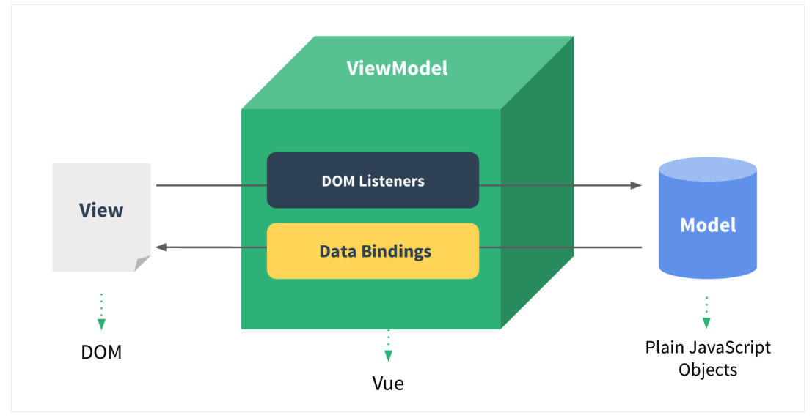

## What is MVVM

MVVM 與 MVC 架構一樣，都是一種軟體架構。MVVM 主要用於建立 UI ，大致上分為三個部分。

## MVVM

+ Model
	+ 和 `MVC` 相同，代表 application 的資料和業務邏輯處理

+ View
	+ 負責 UI 呈現
	+ 顯示來自 `ViewModel`的資料
	+ 將 user 操作傳遞給 `ViewModel`

+ ViewModel
	+ 作為 `View` 和 `Model` 的中間溝通橋樑
	+ 接收來自 `Model` 的資料，傳遞給 `View`
	+ 接收來自 `Vieｗ` 的 user 操作或資料，傳遞給 `Model`

