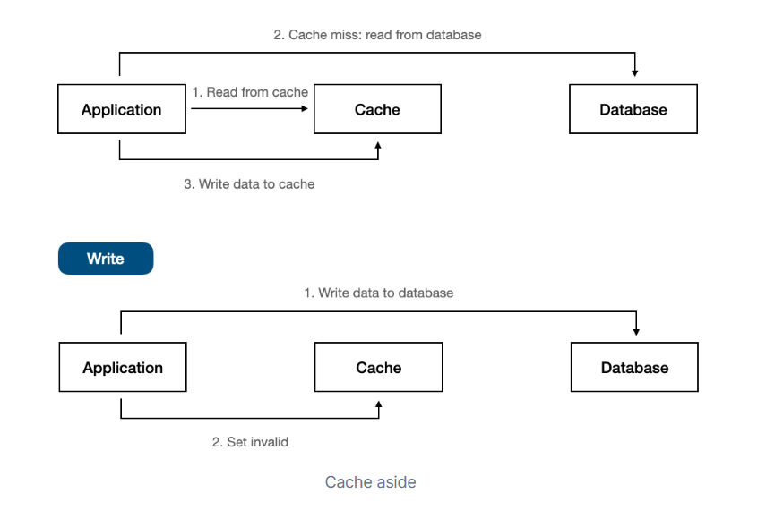
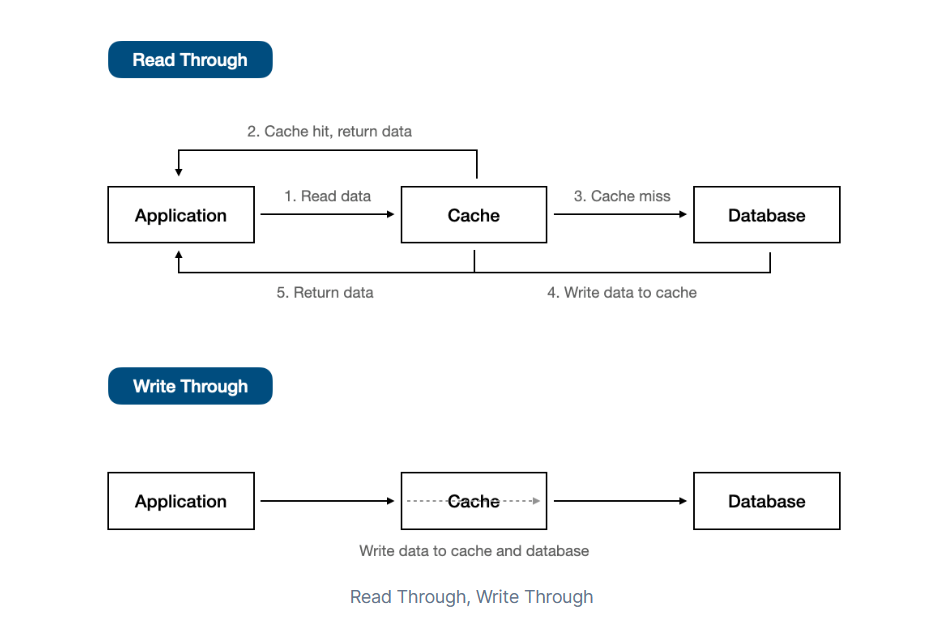
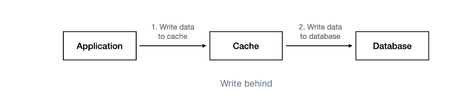

---
# Cache aside

+ Read - 先從cache讀，找到資料的話就直接回傳。如果cache miss再去資料庫找對應的資料回傳後，再將資料寫入cache中。
+ Write - 直接把資料寫入db中，並invalidate cache中對應的資料
+ 適用時機 - ==讀多==的狀況，且cache miss的狀況比較少，且cache miss成本較低時。
+ Pros
	+ ==可以避免cache中有無用資料==，因為只有有需要的資料會被寫到cache
	+ 實作起來較容易
+ Cons
	+ 當cache miss的時候延遲會比較高
	+ 讀取量大的時候，容易造成資料變動頻繁

# Read/Write through

+ Read - 當cache hit的時候，就從cache裡面直接回傳資料。如果cache miss，則先去向db要資料後，*先將資料寫入cache再回傳到app中*	
+ Write - 同時將資料寫入cache以及db中
+ 適用時機 - ==適合寫少讀多==的狀況
+ Pros
	+ 保持資料一致性，因為cache跟db資料會同步
+ Cons
	+ cache miss時延遲高
	+ 需要有較複雜的cache設定，因為cache作為橋梁要面對application以及db

# Write behind 

+ Read - 跟read through相同
+ Write - 會立刻寫入cache，但寫回db的時間則依照狀況而定，也就是cache跟db的寫入是非同步的。
+ 適用時機 - ==寫多==的狀況。假設主要db server無法應對大量寫入操作，可以透過cache作為中間層批次寫入，降低db server掛掉的風險。
+ Pros
	+ 可以透過批次寫入來降低db負載
+ Cons
	+ 因為非同步寫入的關係，可能會有一段時間造成cache與db的資料不一致
	+ 因為非同步的關係，實作起來會更加複雜。

# Reference
[什麼是快取 (Cache)？快取 (Cache) 的機制為何？｜ExplainThis](https://www.explainthis.io/zh-hant/swe/cache-mechanism)
[(21) Three Popular Caching Strategies | LinkedIn](https://www.linkedin.com/pulse/three-popular-caching-strategies-donny-widjaja-mspm-cspo/)
