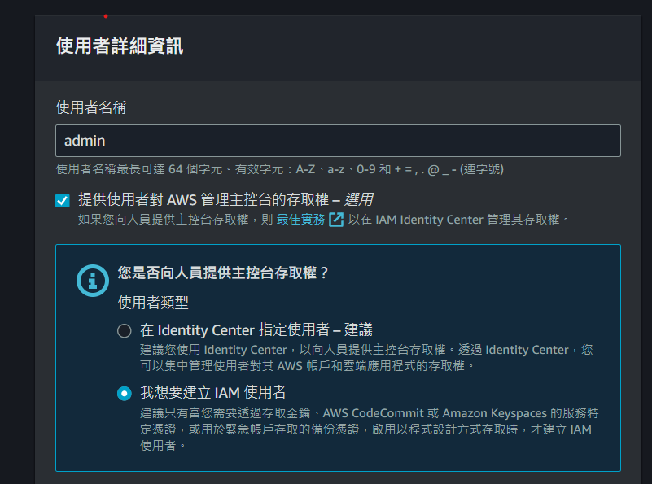

## 建立IAM user

1. 選取右上角安全憑證
2. 左方選單選取存取`存取管理`
3. 

## Reference

[如何建立 IAM user 與使用 IAM 服務. 目錄 1. IAM 2. IAM user 2-1 使用者、使用者群組… | by Chun-Li 春麗 | 彼得潘的 Swift iOS / Flutter App 開發教室 | Medium](https://medium.com/%E5%BD%BC%E5%BE%97%E6%BD%98%E7%9A%84-swift-ios-app-%E9%96%8B%E7%99%BC%E6%95%99%E5%AE%A4/%E5%A6%82%E4%BD%95%E5%BB%BA%E7%AB%8B-iam-user-%E8%88%87%E4%BD%BF%E7%94%A8-iam-%E6%9C%8D%E5%8B%99-263f8b91ccdf)