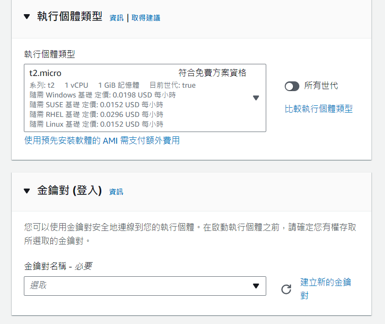
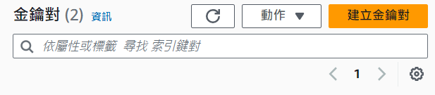

## EC2 instance建立

在進到AWS主控台後，建立EC2 Instance。可以先選擇全部為最低配置。



### Key Pair建立



在EC2的dashboard有一個能夠建立金鑰(*金鑰對*)的地方，點進去後畫面上方會出現以上畫面。在建立金鑰對後，`private key`的檔案會自動下載到電腦上，之後就可以使用這個檔案進行`SSH連線`

### Key Pair選擇

從上面的截圖中可以發現，在登入EC2時，要指定登入的Key Pair。AWS會將`public key`放在開啟的EC2中，`private key`則是在登入時需要指定電腦上的`private key`才能夠成功登入

## SSH連線

```sh
ssh -i <private_key filepath> <username>@<your instance public ip>
```

+ `-i` - 指定`private key`檔案位置
+ `username` - 查詢官方文件根據不同的作業系統有不同的使用者名稱

## Reference

[Manage system users on your Linux instance - Amazon Elastic Compute Cloud](https://docs.aws.amazon.com/AWSEC2/latest/UserGuide/managing-users.html)
