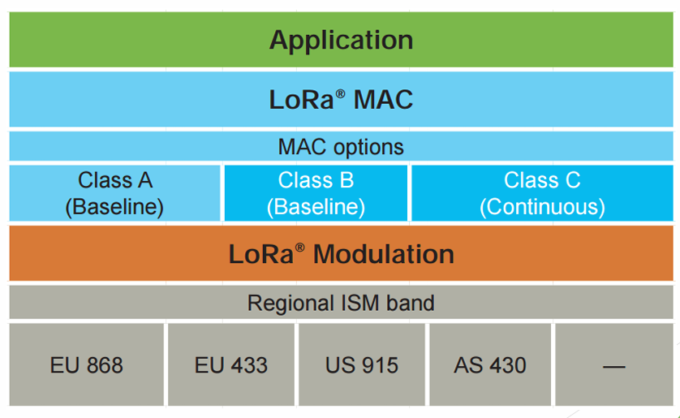

---

# LPWAN(Lower Power Wide Area Networks)

低功耗網路，主要用來滿足長距離低頻寬的需求，定義了物聯網中device之間無線連接的方式。

## Pros
+ 網路架構簡單 -> ==star topology==
+ Direct device connectivity，且基地台可以連接多台devices
+ 功耗低
+ 抗干擾
+ 可以進行雙向溝通
+ 長距離傳輸

## Cons
+ 傳輸延遲高，即時性較低

# LoRaWAN™ vs LoRa®

+ LoRa®
	+ Physical layer的通訊技術 
	+ 基於chrip spread spectrum modulation進行改量
		+ lower power
		+ 傳輸範圍比==FSK==更長
+ LoRaWAN™
	+ Communication protocol
	+ Determine
		+ 電池耗時長短
		+ Network capacity
		+ QoS
		+ Security
## LoRaWAN™

提供三種通訊方式選擇:
+ Class A
	+ uplink完內的一小段時間接受downlink
+ Class B
	+ gateway發送==beacon==來讓end device知道何時需要接受downlink
+ Class C
	+ nearly always open

+ ADR(==Adaptive Data Rate==)
	+ 當節點離基地台越近的時候，功耗越低，傳輸速度也越快。
	+ 反之，功耗越高，速度越慢。