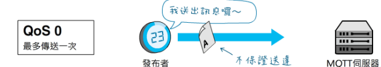
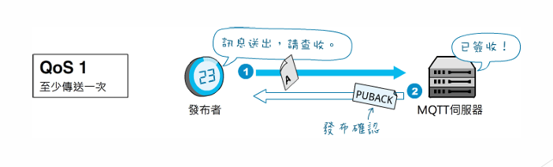
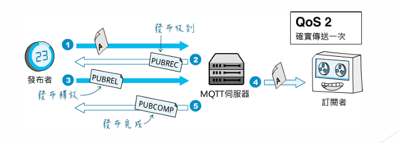

---

# MQTT

[LPWAN](./LPWAN.md)中提到的主要是在處理==physical layer上的通訊技術==，以及定義==link layer的協定==，而MQTT則是負責規範這些device與gateway間==資料傳遞的方式==。

MQTT
+ Header只有2Byte
+ 基於TCP/IP
+ 比HTTP有更少的資料傳輸量能夠減少功耗。
+ IoT中，WebSocket + Message Queue的解決方案
+ 協議輕便，對硬體及頻寬要求低
+ 全雙工
+ 安全性
	+ 可處理防火牆後開發的問題(?)
+ [ Publish subscribe pattern](<##  Publish subscribe pattern>)

##  Publish subscribe pattern

包含以下四個元素
+ Publisher
+ Subscriber
+ Topic
+ Broker(訊息中轉站)

> Publisher為訊息的來源，傳送夾帶有Topic資訊的訊息至Broker，訂閱者向 Broker註冊想要接受到之訊息的Topic，例如有一Publisher發佈一則Topic 為”Test”的訊息，只要是有對Broker註冊Topic為”Test”的Subscriber都能接收 到此訊息。

## QoS

MQTT提供三種訊息傳送服務的QoS
+ QoS0
	+ 最多傳送一次，訊息可能被重複發送或遺失，適合使用於感 測器的原始資料傳送，因為下一則訊息將馬上被送出。
	
+ QoS1
	+ At least once（至少一次）”，保證訊息會被送達，但可能會發生重複發送 的情形。
	+ 接收方透過傳送`PUBBACK`來告知publisher，但若這個過程發生錯誤導致publisher沒接收到訊息，則會重複發送
	
+ QoS2
	+ Exactly once（確保一次）”，保證訊息只會被送達一次，適用於對高度謹 慎之系統，如==金流、計費系統==。
	+ MQTT server回復`PUBREC`，並本身暫存這次訊息，當publisher收到回應時再回傳`PUBREL`讓MQTT server發出訊息。在server成功發送訊息後會回傳`PUBCOMP`表示完成。
	

