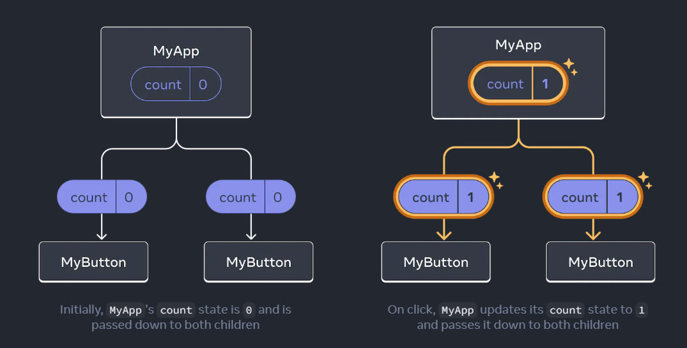

---

## Component

在React中，component是一種UI元件，範圍小至一個button，大至一個page都可以是component。而component就是一種回傳markup的js function。
```js
function MyButton() {  

return (  
	<button>I'm a button</button>  
);  
}
```

```js
export default function MyApp() {  

return (  

	<div>  
		<h1>Welcome to my app</h1>  
		<MyButton />  
	</div>  

);  
}
```

上面的`MyButton`就是一種component，而且要記得component的命名`必須以大寫為開頭`，這樣才可以讓react知道這是一個component。而html tag則必須開頭小寫。


## useState

當有時候需要component去記得一些狀態的時候可以使用`useState()`，用法如下
```js
function MyButton() {  

const [count, setCount] = useState(0);  

// ...
```

前面的count是當前state，setCount則是一個可以去設定state的function，一般來說，命名傳統會是`[something , setsomething]`。useState中的填入的值就是state的初始值。

## Hooks

在react中，名稱以`use`開頭的function就被稱作hooks，前面提到的useState就是hook的一種，當然也可以結合不同的hook來customize自己的hooks。hooks較其他function更加嚴格一點，他只能在component的最上方被使用，如果是要在迴圈或條件式內使用hook，則必須要再多寫一個component在其中。

## Sharing data between component

component間是互相獨立不受到影響的，要讓他們彼此互相交換資料的方式就要向上透過離他們最近的component來處理。


```js
export default function MyApp() {  
	const [count, setCount] = useState(0);    

	function handleClick() {  
		setCount(count + 1);  
	}  
	return (  

	<div>  
		<h1>Counters that update together</h1>  
		<MyButton count={count} onClick={handleClick} />  
		<MyButton count={count} onClick={handleClick} />  
	</div>  
	);  
}
```

```js
function MyButton({ count, onClick }) {  

	return (  
	<button onClick={onClick}>  
		Clicked {count} times  
	</button>  
	);  
}
```

上述的方式中，將state儲存在`MyApp`中，並將state給予兩個獨立的`MyButton` component, 將`count`以及`onclick`留給