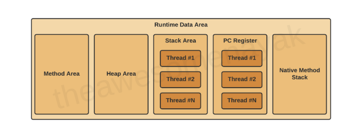

---
tags:
  - Java
  - JVM
---
## What is `Runtime Data Area` 

`Runtime Data Area` 顧名思義就是 JVＭ 中儲存 runtime 資料的地方。主要分為以下五個部分。

- `Method Area(或稱 Metaspace)`
	- 儲存 class metadata 的地方，會儲存像是 class 名稱、常數、method definition、static 變數等。
- `Heap Area`
	- 儲存 instance 的地方，所有動態分配的物件都會被放在這裡。
	- *與 method area 共享記憶體，所以不是 thread safe*
- `Stack Area`
	- 每個 method call 都會產生 stack frame 並存在 stack 中。每個 stack frame 含有以下三種資訊
		- Local Variables
		- Operand Stack
		- Frame Data
	- 主要用在儲存每個方法呼叫時的執行狀態，且*每個  thread 都有自己的 stack*
- `PC Register`
	- 用來記錄當前執行 JVM 指令的 address，*每個  thread 都有自己的 pc register*
- `Native Method Stack`
	- JVM 為了支援 Java 呼叫「非 Java 原生語言所寫的方法（native method）」所設計的記憶體區域。

## Reference

- [JVM Tutorial - Java Virtual Machine Architecture Explained for Beginners](https://www.freecodecamp.org/news/jvm-tutorial-java-virtual-machine-architecture-explained-for-beginners/)