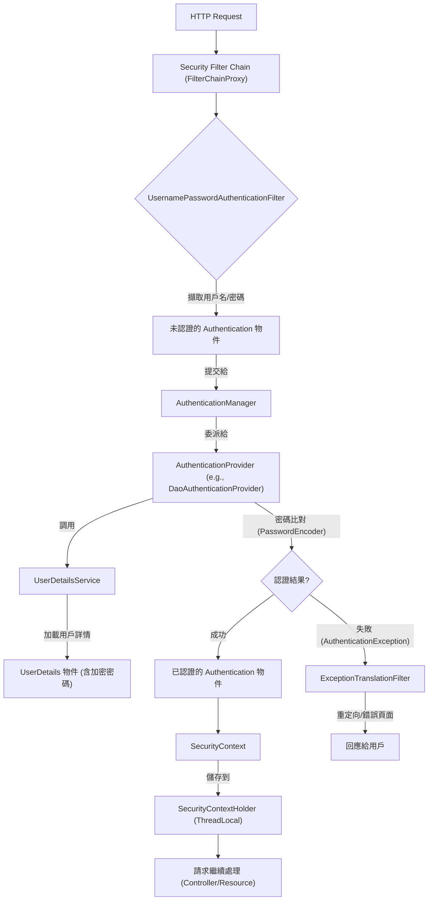

---
tags:
  - Java
  - SpringBoot
  - Security
---

# Spring Security 驗證流程詳解

## 💡 核心概念一覽

* **`SecurityContextHolder`**: 用於儲存當前應用程式執行緒中的 **`SecurityContext`**。
* **`SecurityContext`**: 包含當前已認證用戶的 **`Authentication`** 物件。
* **`Authentication`**: 代表當前請求的認證狀態，內含 **`Principal`** (通常是 `UserDetails`)、憑證及權限資訊。
* **`UserDetails`**: 用戶的詳細資料接口，如用戶名、密碼、帳號狀態和權限等。
* **`UserDetailsService`**: 負責從數據源（如資料庫）加載 **`UserDetails`** 物件。
* **`AuthenticationManager`**: 認證處理的入口，將認證請求委派給一個或多個 **`AuthenticationProvider`**。
* **`AuthenticationProvider`**: 執行實際的身份驗證邏輯，如密碼比對。
* **`Security Filter Chain`**: 一系列 Spring Security 過濾器，按順序攔截和處理請求。

---

##  驗證流程步驟 (以表單登入為例)

當一個匿名請求 (通常是登入請求) 進入 Spring 應用程式時，Spring Security 會啟動其驗證流程。

### 1. 請求進入過濾器鏈 (`Security Filter Chain`)

* HTTP 請求首先會經過 **`FilterChainProxy`**，這是 Spring Security 的核心過濾器。
* `FilterChainProxy` 會根據請求的 URL 選擇一個合適的 **`SecurityFilterChain`**。
* 請求將依序通過該 `SecurityFilterChain` 中的各種 `Security Filter`。

### 2. 身份驗證觸發 (`UsernamePasswordAuthenticationFilter`)

* 當請求到達處理登入的過濾器，例如預設的 **`UsernamePasswordAuthenticationFilter`** 時：
    * 它會從請求中擷取用戶提交的用戶名和密碼。
    * 這些資訊會被封裝成一個未認證的 **`Authentication`** 物件，例如 `UsernamePasswordAuthenticationToken`。

- 也能夠透過自定義的 filter 自行設定 `Authentication`。

### 3. 委派認證 (`AuthenticationManager`)

* `UsernamePasswordAuthenticationFilter` 會將這個 `Authentication` 物件提交給配置的 **`AuthenticationManager`** 進行處理。
* `AuthenticationManager` 是一個接口，其標準實現是 **`ProviderManager`**。`ProviderManager` 不會自己執行認證，而是將認證工作委派給其管理的眾多 **`AuthenticationProvider`** 之一。

### 4. 實際身份驗證 (`AuthenticationProvider`)

* `ProviderManager` 會遍歷其內部註冊的 `AuthenticationProvider` 列表，直到找到一個能夠處理當前 `Authentication` 類型（例如 `UsernamePasswordAuthenticationToken`）的 `AuthenticationProvider`。
* 最常用的是 **`DaoAuthenticationProvider`**，它會執行以下步驟：
    1.  **加載用戶詳情 (`UserDetailsService`)**
        * `DaoAuthenticationProvider` 會調用配置的 **`UserDetailsService`**。
        * `UserDetailsService` 負責根據 `Authentication` 物件中的用戶名，從後端數據源（如資料庫）加載對應的 **`UserDetails`** 物件。
        * `UserDetails` 物件包含了用戶的真實密碼（通常是加密的）、權限列表以及帳戶狀態等資訊。
    2.  **密碼比對 (`PasswordEncoder`)**
        * `DaoAuthenticationProvider` 會使用配置的 **`PasswordEncoder`**（例如 `BCryptPasswordEncoder`）來比對用戶提交的原始密碼與從 `UserDetails` 中獲取的加密密碼。
        * **如果密碼匹配：**
            * 驗證成功！`AuthenticationProvider` 會返回一個**已認證的 `Authentication` 物件**。這個物件通常會將其 `Principal` 設置為剛才加載的 `UserDetails` 物件，並將 `isAuthenticated()` 設置為 `true`。
        * **如果密碼不匹配或帳戶狀態異常：**
            * 驗證失敗！`AuthenticationProvider` 會拋出 **`AuthenticationException`** (例如 `BadCredentialsException`, `DisabledException`, `LockedException` 等)。

### 5. 存儲認證結果 (`SecurityContextHolder`)

* **如果驗證成功：**
    * 成功返回的**已認證 `Authentication` 物件**會被儲存到 **`SecurityContext`** 中。
    * 這個 `SecurityContext` 進一步被儲存到 **`SecurityContextHolder`** 中。`SecurityContextHolder` 預設使用 `ThreadLocal` 來確保每個請求都有獨立且安全的 `SecurityContext`。
    * 這使得在應用程式的任何地方，都可以透過 `SecurityContextHolder.getContext().getAuthentication()` 輕鬆地獲取當前已認證用戶的詳細資訊和權限。
* **如果驗證失敗：**
    * `AuthenticationException` 會被 **`ExceptionTranslationFilter`** 捕獲。
    * `ExceptionTranslationFilter` 會根據異常類型進行處理，通常會重定向到登入頁面，並顯示錯誤訊息。

### 6. 後續授權檢查 (Optional)

* 一旦用戶成功驗證並 `Authentication` 物件被存儲在 `SecurityContextHolder` 中，後續的請求就會攜帶這個已認證的狀態。
* 對於需要授權的資源訪問，例如特定的 URL 路徑或方法調用，Spring Security 會通過 **`AuthorizationFilter`** (或 `FilterSecurityInterceptor`) 檢查當前 `Authentication` 物件中的權限，並由 **`AccessDecisionManager`** 決定用戶是否有權訪問該資源。

---

## 流程圖解

## Reference

- [Understanding Spring Security Authentication Flow | by Ayush Singh | Medium](https://medium.com/@aprayush20/understanding-spring-security-authentication-flow-f9bb545bd77)