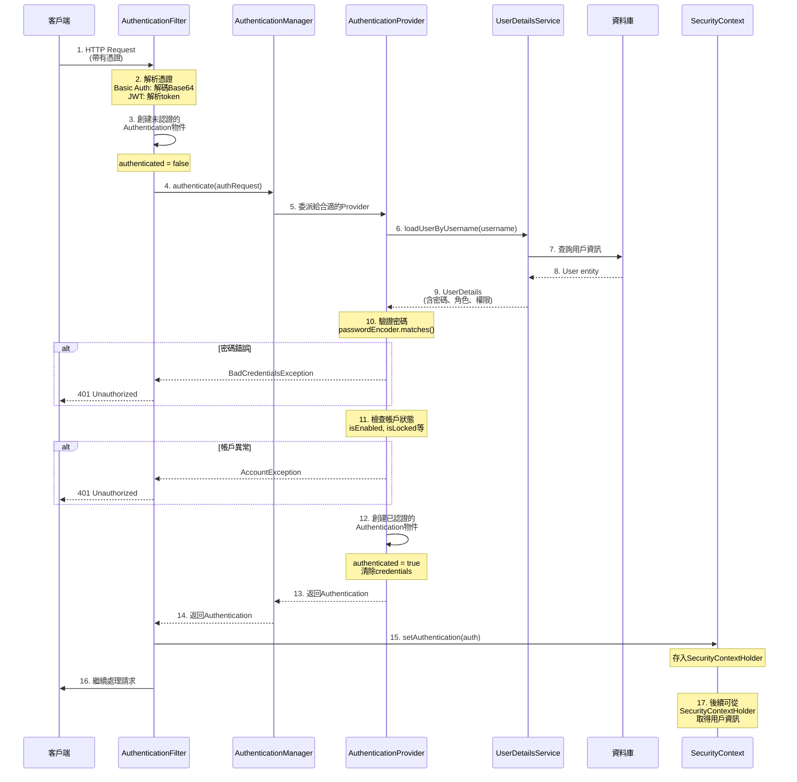

## 驗證流程

```mermaid
sequenceDiagram
    participant Client as 客戶端
    participant Filter as AuthenticationFilter
    participant Manager as AuthenticationManager
    participant Provider as AuthenticationProvider
    participant UserService as UserDetailsService
    participant DB as 資料庫
    participant Context as SecurityContext
    
    Client->>Filter: 1. HTTP Request<br/>(帶有憑證)
    
    Note over Filter: 2. 解析憑證<br/>Basic Auth: 解碼Base64<br/>JWT: 解析token
    
    Filter->>Filter: 3. 創建未認證的<br/>Authentication物件
    Note over Filter: authenticated = false
    
    Filter->>Manager: 4. authenticate(authRequest)
    
    Manager->>Provider: 5. 委派給合適的Provider
    
    Provider->>UserService: 6. loadUserByUsername(username)
    UserService->>DB: 7. 查詢用戶資訊
    DB-->>UserService: 8. User entity
    UserService-->>Provider: 9. UserDetails<br/>(含密碼、角色、權限)
    
    Note over Provider: 10. 驗證密碼<br/>passwordEncoder.matches()
    
    alt 密碼錯誤
        Provider-->>Filter: BadCredentialsException
        Filter-->>Client: 401 Unauthorized
    end
    
    Note over Provider: 11. 檢查帳戶狀態<br/>isEnabled, isLocked等
    
    alt 帳戶異常
        Provider-->>Filter: AccountException
        Filter-->>Client: 401 Unauthorized
    end
    
    Provider->>Provider: 12. 創建已認證的<br/>Authentication物件
    Note over Provider: authenticated = true<br/>清除credentials
    
    Provider-->>Manager: 13. 返回Authentication
    Manager-->>Filter: 14. 返回Authentication
    
    Filter->>Context: 15. setAuthentication(auth)
    Note over Context: 存入SecurityContextHolder
    
    Filter->>Client: 16. 繼續處理請求
    
    Note over Context: 17. 後續可從<br/>SecurityContextHolder<br/>取得用戶資訊
```
