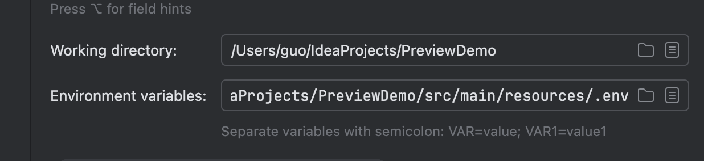

### application.properties 讀取

在軟體開發的過程中，有些值需要隨著環境改變。這時可以透過讓 `application.properties` 去讀取環境變數來達到這個效果

```yml
server.port=${SERVER_PORT:8080}
```

以上面的狀況來說，`application.properties` 會去讀取名為 `SERVER_PORT` 的環境變數。冒號後方是預設值，當找不到該環境變數就會使用這個值。

### 搭配 intellij 環境變數

在右上角的 ... 按鈕選取 `edit`，可以在裡面看到環境變數編輯，沒有的話就選擇畫面中的 `more options` 來加入設定。

可以透過直接輸入環境變數，或指定`.env`檔案讓 intellij 進行設定。



![[envfile.png]]
## Reference

- [在Spring Boot的application.properties中使用环境变量_application.properties 环境变量-CSDN博客](https://blog.csdn.net/BlingblingFu/article/details/120857303)