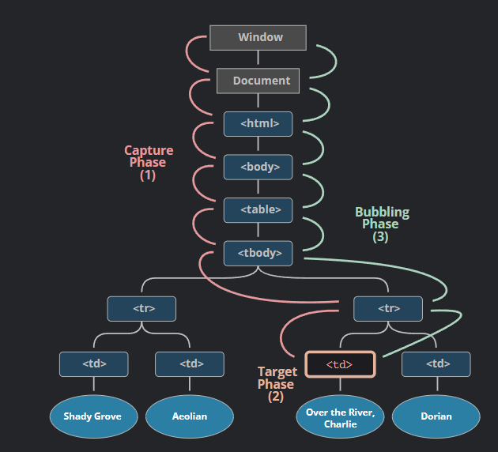

---

# Event delegation

事件委派，通常用於在子元素很多，且都需要加上相同listener的時候，可以透過==將listener放在父元素==上，來減少記憶體的消耗，並讓程式碼更好閱讀。

## Behind the scene

當一個事件被觸發的時候，Browser會經歷三個階段
+ Capture phase
	+ 向下查找event發生的元素，以上圖來說，是最底層的td
+ Target Phase
	+ 找到event發生的元素後，在target phase觸發對應的event
+ Bubbling Phase
	+ 向上尋找是否有對應的event listener，如果有的話則一併觸發直到回到window。

## Reference

圖片來源: [Bubbling and capturing (javascript.info)](https://javascript.info/bubbling-and-capturing)
[請說明瀏覽器中的事件委派、捕獲、冒泡｜ExplainThis](https://www.explainthis.io/zh-hant/swe/fe-event-delegation-capture-bubble)
