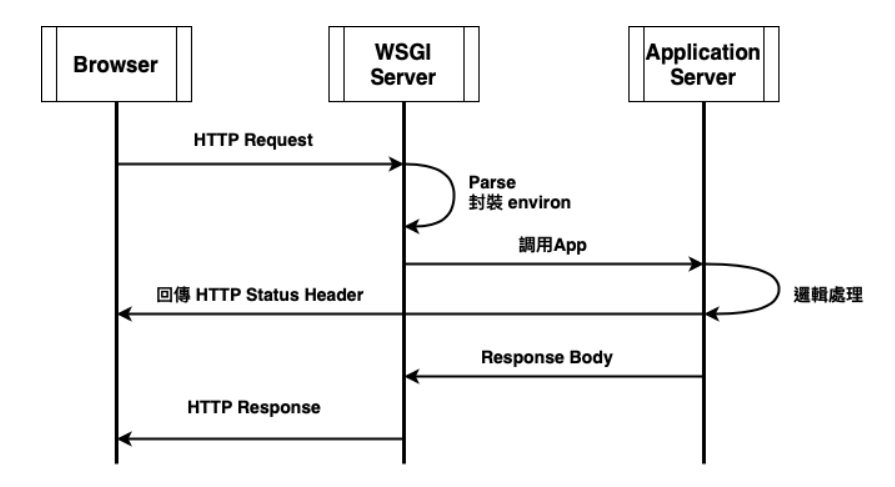

---

## What is WSGI

 全名為Web Server Gateway Interface，定義了web sever跟python web application之間溝通的規範，只要web server有符合wsgi規範，就可以跟符合規範的application串接，是python專用協議。

## Why wsgi is needed

因為傳統的web server沒有辦法執行python程式碼，需要透過符合wsgi協議的server，來解讀pythont程式碼，並用來接收來自網路的請求與進行回應，使用結構大概會如下。


圖片擷取自 https://minglunwu.com/notes/2021/flask_plus_wsgi.html/ 的文章

+ **Web Server**
	+ 用來作為反向代理、負載平衡等等
+ **WSGI Server**
	+ 接收來自`Web Server`的請求，經過wsgi規範的流程後，將請求參數轉交給`App Server`
+ **App Server**
	+ 接收到對應的請求參數後，由app server執行預先撰寫好的邏輯，來處理請求


## How WSGI work?



1. HTTP Request
	+ 接收來自`Web Server`的HTTP請求
2. Parse, 封裝成Environ
	+ `WSGI Server`收到請求後將請求解析成`Key-Value`的形式，並儲存到`environ`變數中，作為傳遞給`App Server`處理的資料
3. 調用app
	+ `WSGI Server`會將`environ`變數傳遞給`App Server`。
4. 邏輯處理
	+ `App Server`處理接收到的資訊
5. wsgi先回傳HTTP Status Header
	+ `WSGI Server`收到處理結果前，先回傳**Response Header**e給瀏覽器
6. App Server回傳**Response body**到wsgi server
7. WSGI Server回傳response body到瀏覽器


## 常見的WSGI Server

+ gunicorn
	+ 只能在Unix-like的OS下運行
+ uwsgi
+ Waitress
	+ 適用於Windows及Unix OS


以下以Waitress為使用範例

1. 安裝套件
```sh
pip install waitress
```

2. 啟動寫好的程式
```sh
waitress-serve app:app
```

這樣一來，python程式碼就會以WSGI Server啟動。

冒號前代表的是要啟動的`module name`，冒號後代表的是`該模組中要啟動的object name`

## Reference
https://medium.com/@eric248655665/%E4%BB%80%E9%BA%BC%E6%98%AF-wsgi-%E7%82%BA%E4%BB%80%E9%BA%BC%E8%A6%81%E7%94%A8-wsgi-f0d5f3001652
https://minglunwu.com/notes/2021/flask_plus_wsgi.html/
