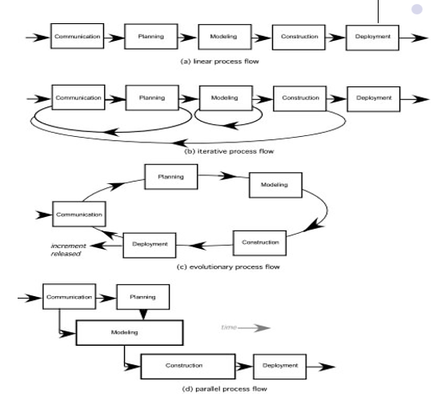

---
### Types of Process Flow
+ Linear flow
+ Iterative flow
+ Evolutionary flow
+ Parallel flow

### Waterfall model 
### The V model

### The Increamental Model

結合了linear model 以及 parallel model
目的是藉由最一開始的大綱需求來與客戶一同完成整個最終系統。在人數有限的情況下是適合使用的開發模型之一。
*限制 : 需要有較清楚的需求會比較適合*

*與evolutioinary的差異*
incremental development : 從一個小的子系統開始，在每一次新的版本釋出中新增新的功能

evolutionary : 從一個完整的系統開始，每一次的新版本釋出都是功能的改變(functionality changes)

### Specialized Process Model

1. Component-based Model
	將軟體變為類似商品的感覺，使的軟體被重複利用，也可以減少開發的週期
	
2. The formal Methods Model
>The formal methods model encompasses a set of activities that leads to formal math- ematical specification of computer software. Formal methods enable you to specify,  develop, and verify a computer-based system `by applying a rigorous, mathematical  notation.`

主要是藉由正規的數學方式來找到軟體的的缺陷，盡力打造defect-free的軟體。
*限制: 花費時間，也較難作為溝通的機制，還需要廣泛的訓練(?)*

### !! Aspect

*customer concerns that cut across multiple system functions, features and information*

### Unified Process

A framework for object-oriented software engineering using UML

*use-case driven , architecture-centric , iterative, incremental* model

five phase
+ Inception
	+ communication
	+ planning
+ Elaboration
	+ communication
	+ modeling
+ Construction
	+ construction
+ Transition
	+ construction
	+ deployment
+ Production
	+ release

## Personal Software Process

A engineering methodology that an individual developer can continuously improve his/her ability.

### Team Software Process

Provide a defined process framework for managing , tracking and reporting teams' progress.
