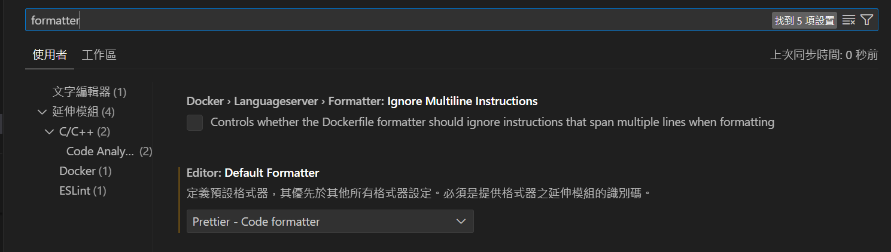

---

## 在vscode中使用Prettier

在vscode中有prettier套件可以使用，安裝完成後，要先打開設定面板，搜尋`formatter`

，先將`default formatter`改為prettier後才會生效。

prettier套件本身就包含了一些預設的格式，透過
![[Pasted image 20240205120229.png]]
## Reference

[Fixing Prettier not working with VSCode - DEV Community](https://dev.to/dmytrych/fixing-prettier-not-working-with-vscode-44ml)
[隨時隨地格式化 - Prettier - iT 邦幫忙::一起幫忙解決難題，拯救 IT 人的一天 (ithome.com.tw)](https://ithelp.ithome.com.tw/articles/10294321)