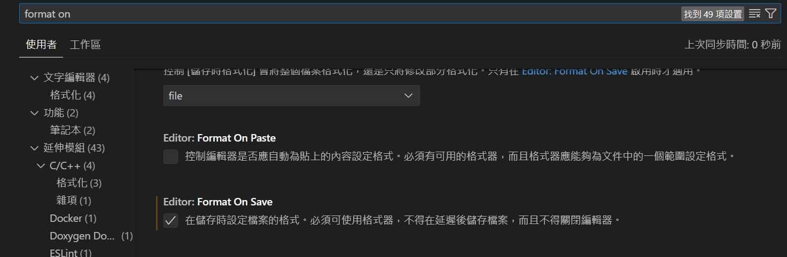

---

## 在vscode中使用Prettier

在vscode中有prettier套件可以使用，安裝完成後，要先打開設定面板，搜尋`formatter`

，先將`default formatter`改為prettier後才會生效。

prettier套件本身就包含了一些預設的格式，透過開啟`format on Save`可以在儲存時依照format進行格式化。


如果想要覆蓋掉預設的prettier設定，可以透過在當前資料夾下新增`.prettierrc`檔案，在裡面自行指定想要的程式碼格式。大致如下:
```json
{
	"printWidth": 80, //單行最多字數
	"tabWidth": 2,
	"useTabs": false
}
```

*官方文件: [Configuration File · Prettier](https://prettier.io/docs/en/configuration)*

在開源專案中也常透過prettier來進行程式碼格式檢查，通常會將這些prettier指令寫在package.json中做為script。以下取自monkeytype的package.json:
```json
...
"scripts": {
	...
	...
	"pretty": "prettier --check \"./backend/**/*.{ts,json,js,css,html}\" \"./frontend/**/*.{ts,js,scss}\" \"./frontend/static/**/*.{json,html,css}\"",

    "pretty-code": "prettier --check \"./backend/**/*.{ts,js,json,css,html}\" \"./frontend/**/*.{ts,js}\" \"./frontend/src/**/*.scss\"",

    "pretty-code-be": "prettier --check \"./backend/**/*.{ts,js,json,css,html}\"",

    "pretty-code-fe": "prettier --check \"./frontend/**/*.{ts,js}\" \"./frontend/src/**/*.scss\"",

    "pretty-fix": "prettier --write \"./backend/**/*.{ts,json,js,css,html}\" \"./frontend/**/*.{ts,js,scss}\" \"./frontend/static/**/*.{json,html,css}\"",

    "pr-check-lint-json": "cd frontend && npx gulp pr-check-lint-json",

    "pr-check-quote-json": "cd frontend && npx gulp pr-check-quote-json",
    ...
    ...
}
```

prettier常見指令可以查看官方文件: [CLI · Prettier](https://prettier.io/docs/en/cli)
## Reference

[Fixing Prettier not working with VSCode - DEV Community](https://dev.to/dmytrych/fixing-prettier-not-working-with-vscode-44ml)
[隨時隨地格式化 - Prettier - iT 邦幫忙::一起幫忙解決難題，拯救 IT 人的一天 (ithome.com.tw)](https://ithelp.ithome.com.tw/articles/10294321)
[Prettier · Opinionated Code Formatter](https://prettier.io/)