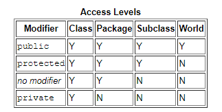

## Primitive data type vs Non-primitive data type

+ Primitive data type
	+ 小寫開頭
	+ 單純進行型別的宣告
+ Non-primitive data type 
	+ 通常是class
	+ 其中包含一些可用的method
	+ Interger

## jshell

在Java 11後提供的一個互動式介面，是一個REPL(Read-Evaluate-Print-Loop)。能夠讓我們快速的執行一段程式碼片段，快速的進行測試我們撰寫的邏輯，像是一段function、expression等等，有點類似瀏覽器中的Javascript Console用途。

啟動:
```shell
jshell
```

退出:
```shell
jshell> exit
```

*Reference: [Java11新特性（三）——JShell使用教程&指南_执行jshell需要在哪个目录-CSDN博客](https://blog.csdn.net/Hello_World_QWP/article/details/88836823)*

## Constructor

+ 通常用來初始設instance的屬性，不需要也==不能有==回傳值


>[!info] 
>Java每一個檔案只能有一個public class
## Access Level Modifiers



+ public
	+ class - 可以被任意class存取
	+ property and method - 可以被任意class存取
	+ constructor - 可以被任意class存取
+ protected
	+ class - protected無法用於class
	+ property and method  - 可以被同一個package中的class以及subclass存取(==即使sub class不在同pacakge==)
	+ constructor - 同上
+ default (package-private)
	+ class - 只能被同pacakge訪問
	+ property and method - 只能被同package存取
	+ constructor - 只能被同pacakge訪問
+ private 
	+ 不能用於class
	+ property and method - 僅能被同class存取
	+ constructor - 同上

https://docs.oracle.com/javase/tutorial/java/javaOO/accesscontrol.html


## Final

+ Java中並沒有const的實作，所以遇到要固定值的狀況需要使用`final` keyword
+ 與常見const不同的是，其他程式語言在進行const宣告的時候通常需要`一併賦值`，而`final`的定義則是`被賦值一次後即不可更改`，所以被宣告`final`的變數在最一開始==可以不要賦值的==
+ 如果一個class不該被繼承的話，可以透過`final`來限定它不能夠被繼承
## Method Overloading vs Overriding

+ overloading決定要使用哪個method判別方式是`依照method的參數數量以及型別`
+ override時的，訪問權限的設定只能等於或大於要override的method
	+ 當要override一個protected的method時，權限的設定只能是`protectd`或`public`

## About Class

### 常見method

+ 用來印出class相關資訊

### Inheritance

+ instanceof - 用來確定object是否為某個類別的instance
+ subclass無法繼承 
	+ private attribute
	+ private method
	+ Nested class
	+ ==其他都可以==

#### Super

+ 指父類別的class

### Abstract class

+ 無法被初始化
+ 可以具備`abstract method` 
	+ `abstract method`
	+ 有繼承到`abstract method`的class==必須== override該function

### Interface

+ 可以將`interface`想成更嚴格的class
	+ 不具備constuctor
	+ 其中的變數預設為`public static final`，==即使不加上關鍵字也是如此==
	+ method預設為`public abstract`, 無法降低到其他更低的使用權限。

### Object Equality

+ `==`
	+ 比較的是記憶體內的儲存位置。
+ `equals`
	+ 原生equals就是利用`==`的方式進行比較
	+ 如果要改變equal的規則需要自行override

### Package

+ 透過將不同的檔案放置在不同的package中，可以避免不同部分的功能因為產生重複的檔案命名而造成衝突。是一個Namespace的概念。

+ Java檔通常會放在src檔案下，以下面的程式碼來說，這個java檔案要被放置的路徑就在`/src/com/example/utils/`這個資料夾中
```java
package com.example.utils;

public class MathUtils {
    public static int add(int a, int b) {
        return a + b;
    }
}

```

## Generics

+ 將type作為參數傳入到function或class中

```java
// Generic class
public class Box<T> {
    private T content;
    public void set(T content) { this.content = content; }
    public T get() { return content; }
}

// Generic interface
public interface Processor<T> {
    void process(T input);
}

// Generic method
public <E> void printArray(E[] array) {
    for (E element : array) {
        System.out.println(element);
    }
}
```


## Array

### 常見method

+ for( item: array ) - 用於進行iteration
```java
//str指的就是陣列中的每一個item
for (String str: strArray){
	//....
}
```

+ .arrayCopy() - 複製字串
	+ param

+ sort
	+ param -  an Array
	+ 字串陣列的排序則是以字串開頭的字母作為排序

+ String.compareTo()
	+ param - an String
	+ 左方字串小於右方字串 - 回傳-1
	+ 左方字串等於右方字串 - 回傳0
	+ 左方字串大於右方字串 - 回傳1

+ `...`(varargs)
	+ 實際上是宣告一個參數陣列。但作為參數傳入時，可以傳入任意數量的參數，也可以不傳。
```java
public void printStrings(String... strings){
	for(String str: strings){
		System.out.println(str);
	}
}
```


## List

+ 相對於Array來說更為靈活
+ 透過`add()`,  `remove()`, `get()`來存取以及新增元素
+ 使用resizing array(?)

```java
import java.util.ArrayList;
import java.util.List;

public class Main {
    public static void main(String[] args) {
        List<String> arrayList = new ArrayList<>();
        arrayList.add("Apple");
        arrayList.add("Banana");
        arrayList.add("Cherry");

        for (String fruit : arrayList) {
            System.out.println(fruit);
        }
    }
}

```

## Annotation

+ Retention - 決定annotation的週期
	+ RetentionPolicy.SOURCE - 只會出現在source code中
		+ 通常用於告訴編譯器進行程式碼檢查、程式碼風格確認等
		+ 不會被編譯進`.class`
		+ `@Override`
	+ RetentionPolicy.CLASS
		+ default value - 當Retention annotation中==沒有指定時==，會使用這個做為預設值
		+ 不會保留在`RUNTIME`中
	+ RetentionPolicy.RUNTIME
		+ annotation在runtime也會保留，通常都會搭配Reflection進行讀取
		+ JUnit的`@Test`
+ Target - annotation的目標對象，決定annotation可以作用在哪些目標上
	+ class
	+ method
	+ variable
+ Element
	+ 可以想像成在annotation中的變數
	+ annotation中==不能包含method==

以下面例子來說，`MyAnnotation`就會包含`value`、`number`、`tags`三個變數。
```java
import java.lang.annotation.Retention;
import java.lang.annotation.RetentionPolicy;

@Retention(RetentionPolicy.RUNTIME)
@interface MyAnnotation {
    // 定义注解元素
    String value();
    int number() default 0;
    String[] tags() default {};
}

```


## Reflection
