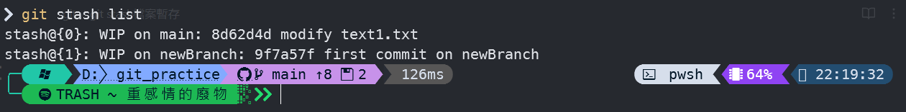

---

在開發時，若是因為遇到緊急狀況需要先放下手頭上的開發進度，切換到其他分支。這時可以利用stash的方式先將檔案暫存起來。

```bash
git stash
```

輸入指令後，就會將當前的更動儲存起來。這時候可以利用`stash list`來列出有那些存檔。
```bash
git stash list
```

畫面如下。




當我們切回到先前開發的分支，要進行存檔的回復時，可以藉由查看stash list中的內容。並搭配`stash pop`來將存檔從list中取出，並回復至先前的狀態。

```bash
git stash pop <index>
```

後面填寫的index就是在stash list中，雙括號內的數字。

```bash
git stash apply <index>
```
利用`apply`當然也可以完成回復狀態的效果，不過這樣的作法並不會將存檔從stash list中清除，若單單只用`apply`，長時間下來可能會造成stash list雜亂，而利用`pop`則可以在將存檔從stash list移除的同時，回復存檔的狀態。如何在兩個方式之間取捨就看使用者的方式。

若是想要在暫存的工作階段中留下訊息確保未來查看stash list時可以快速找到想要的階段，可以使用以下格是
```shell
git stash save <your message>
```